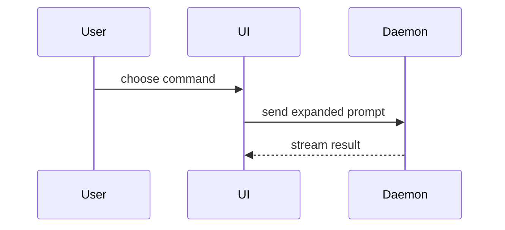

Help the user understand the current topic of conversation visually. Skip the preamble and keep prose brief. Pick the smallest view that makes the key point clear.

- Show logic or an algorithm as pseudocode:

```text
on(save)
  if content is unchanged
    return cached result
  write new content
  return fresh result
```

- Show runtime control flow as a call tree:

```text
submitForm
  createSession
    persistPrompt
    launchAgent
  navigateToSession
```

- Show UI structure as a component tree, including state and module boundaries that matter:

```tsx
<SessionPage> (apps/example/src/routes/session.tsx)
  useSessionEvents()
  <SessionToolbar>
    <RunSkillButton> (packages/ui)
```

- Show file responsibility or a broad refactor as a shallow file tree:

```text
src/
|-- commands/       # parses user actions
|-- sessions/       # owns session state
`-- transport/      # sends API requests
```

- Show component interaction, control flow, or data flow with Mermaid:



- Use `diff` when the point is what changes and the surrounding shape already exists. Match the diff shape to the topic.

For a component change:

```diff
 <SessionPage>
   useSessionEvents()
   <SessionToolbar>
+    <RunSkillButton />
   <SessionTimeline>
+    <SkillResultCard />
```

For a file-layout change:

```diff
 src/
 |-- commands/
+|   `-- show-me.ts       # expands the slash command
 |-- sessions/
-`-- transport.ts
+`-- transport/
+    |-- client.ts
+    `-- stream.ts
```

For a call-tree or call-stack change:

```diff
 submitForm
   createSession
     persistPrompt
+    expandSkillMention
     launchAgent
-  navigateToSession
+  navigateToSession
+    subscribeToEvents
```

For a state or control-flow change:

```diff
 on(save)
-  write content
+  if content is unchanged
+    return cached result
+  write new content
+  invalidate cache
```

- Show the whole block when most of it is new, when omitted context would hide ownership or order, or when the user needs a copyable target shape:

```ts
function expandSkill(command: string): string {
  const skillName = command.slice(1)
  return `use the ${skillName} skill`
}
```

- For a visual UI, layout, state comparison, or concept too dense for Mermaid, create one focused HTML artifact using the `html` skill. Match the product's colors, type, spacing, and components; use real labels and data; support desktop and mobile;

- Place each visual next to the short text it supports. Keep only the calls, files, props, states, and boundaries needed to answer the user's current question.

## Planning reviews and code walkthroughs

For planning reviews, lead with proposed flow → boundary contracts → architecture → brief implementation sequence. Expand implementation details when they affect a reviewed decision.

For “walk me through this” or “how does this work?”, orient the user to the capability, actors, and entrypoint; trace one concrete scenario through its boundary contracts; then show the architecture and discuss questions or zoom into a boundary. Use the evidence and diagram guidance below to describe existing behavior and distinguish observed behavior from inferred rationale.

When designing or evaluating TypeScript or Go code, apply [coding-standards](../workflow/coding-standards/SKILL.md) and its relevant references. This presentation order does not reduce the required engineering checks. For a requested assessment of changes against standards and a spec, use [code-review](../workflow/code-review/SKILL.md).

## Developer review and discussion
- When this artifact is for human review before further work, follow [the review pause](../references/work-lifecycle.md#pause-for-human-review): present the ready view and decision needed, then end the turn. Do not advance dependent implementation or revise the review target while awaiting the answer.
- Show or link the acceptance contract. If the intended outcome is unclear, read [define-outcome](../define-outcome/SKILL.md). Distinguish required visual/behavior details from illustrative ones; tie review questions to unresolved criteria and identify required human decisions.

When iterating, show the current proposal, the meaningful change from the previous version, and the specific feedback or decision needed. Label experiments and accepted decisions separately. Retain a brief reason for rejected alternatives when it informs the discussion; avoid reproducing every prior version.

For work needing shared review, show the decision being discussed and choose the smallest useful format: an inline block, existing PR/document, or a focused artifact in the repository's `docs/` convention. Use Markdown with editable diagrams by default; use HTML when interaction or layout earns it. Publishing or attaching requires authorization; a local file path is not a shared URL.

Include only what the decision needs:

- Problem, constraints, and the review question in a few bullets.
- Current → proposed structure or behavior. Label proposed, observed, and inferred elements distinctly.
- Pseudocode, sequence/state diagrams, or concrete input/output/error examples. Show important failure paths, ordering, and ownership boundaries.
- Short rationale, tradeoffs, and open questions with decision owners when known.
- Observable acceptance criteria and verification approach; label checks not yet run as proposed.

Label pseudocode as pseudocode; do not imply it compiles. Link implementation sources and evidence for claims. Verify diagrams against those sources, and check rendering in the intended surface when possible; disclose when rendering is unverified.

For ongoing discussion, read [work-lifecycle](../references/work-lifecycle.md). Record accepted decisions and unresolved disagreements, then update visuals and affected plans after feedback. Preserve rationale needed by a fresh reviewer; avoid duplicating execution progress in the review artifact.
